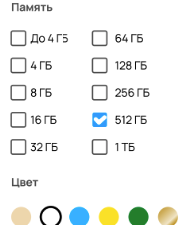
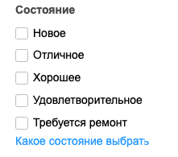

# BUG-REPORT
*Примечания:
- На реальном проекте баги заносятся в баг-трекер (например, Jira), где автоматически проставляется автор, статус и дата создания. При выполнении данного задания я буду считать, что эти данные есть по умолчанию.
- Также для лакончиности и простоты восприятия предлагаю не дублировать повторяющуюся для всех багов информацию, а именно:

|                       |                                                                                           |
|:----------------------|:------------------------------------------------------------------------------------------|
| `Предусловия`         | Открыть сайт https://www.avito.ru/                                                        |
| `Окружение`           | - Прод - Браузер Google Chrome Версия 123.0.6312.87 Официальная сборка, arm64 |
| `Тестовые устройства` | MacBook Air M1 / 16ГБ / 2020 macOS Sonoma 14.2.1 (23C71)                          |

- Все сравнение производится с сайтом https://www.avito.ru/ в production, и все формулировки "больше необходимого", "несоответствие оригиналу" и им подобные являются отсылкой к данному источнику.
- Точный адрес сайта, где результаты поиска соотвествуют выставленным фильтрам: https://www.avito.ru/moskva/telefony/mobilnye_telefony/samsung-ASgBAgICAkS0wA2crzmwwQ2I_Dc?f=ASgBAgECBESwwA3k_ze0wA2crzmwwQ2I_Dfm4A36wVwBRcaaDBV7ImZyb20iOjAsInRvIjo1MDAwMH0
- Расхождения между версткой оригинального сайта и скриншотом для проверки слишком существенны для сравнения в Pixel Perfect.
- Для удобства каждому баг проставлен хештег, обозначающий принадлежность к определенному разделу тестируемой страницы: [HEADER], [BREADCRUMBS], [TITLE], [FILTERS], [MAIN], [FOOTER]

## BG_01
| **Логотип**            | [HEADER]                                                                              |
|:-----------------------|:--------------------------------------------------------------------------------------|
| `Идентификатор`        | BG-01                                                                                 |
| `Заголовок`            | Орфографическая ошибка в логотипе в хедере                                            |
| `Описание`             | Вместо “Avito” логотип в хедере написан как “Awito”                                   |
| `Шаги воспроизведения` | Посмотреть на верхнюю часть страницы, где располагается хедер, конкретно - на логотип |
| `Текущий результат`    |                                          |
| `Ожидаемый результат`  |                                          |
| `Критичность`          | Trivial                                                                               |
| `Приоритет`            | High                                                                                  |

## BG_02
| **Рубрикатор**         | [HEADER]                                                                                                                                                                                                                                                                                                                                                                                         |
|:-----------------------|:-------------------------------------------------------------------------------------------------------------------------------------------------------------------------------------------------------------------------------------------------------------------------------------------------------------------------------------------------------------------------------------------------|
| `Идентификатор`        | BG-02                                                                                                                                                                                                                                                                                                                                                                                            |
| `Заголовок`            | Стилистические несоответствия в кнопке-рубрикаторе "Все категории"                                                                                                                                                                                                                                                                                                                               |
| `Описание`             | 1. Border radius меньше необходимого (в оригинале 6px) 2. Отступы (паддинги) меньше необходимого 3. Размер svg иконки должен быть 20px на 20px, а левая часть иконки не должна быть выделена жирным. 4. Типография: начертание текста расходится с оригиналом в жирности, размере. 5. Справа от элемента должен быть отступ (марджин) до следующего элемента (поисковой строки). |
| `Шаги воспроизведения` | Посмотреть на верхнюю часть страницы, где располагается хедер, конкретно - на элемент "Все категории"                                                                                                                                                                                                                                                                                            |
| `Текущий результат`    |                                                                                                                                                                                                                                                                                                                                                     |
| `Ожидаемый результат`  |                                                                                                                                                                                                                                                                                                                                                     |
| `Критичность`          | Minor                                                                                                                                                                                                                                                                                                                                                                                            |
| `Приоритет`            | Medium                                                                                                                                                                                                                                                                                                                                                                                           |

## BG_03
| **Строка поиска**      | [HEADER]                                                                                                                                                                                                                                     |
|:-----------------------|:---------------------------------------------------------------------------------------------------------------------------------------------------------------------------------------------------------------------------------------------|
| `Идентификатор`        | BG-03                                                                                                                                                                                                                                        |
| `Заголовок`            | Стилистические несоответствия в строке поиска "Поиск по объявлениям"                                                                                                                                                                         |
| `Описание`             | 1. Border radius меньше необходимого (в оригинале 6px) 2. Отступ слева больше необходимого, вертикальные паддинги меньше необходимого. 3. Длина поисковой строки больше, чем в оригинале. 4. Слева должен быть отступ (марджин). |
| `Шаги воспроизведения` | Посмотреть на верхнюю часть страницы, где располагается хедер, конкретно - на элемент "Все категории"                                                                                                                                        |
| `Текущий результат`    |                                                                                                                                                                                                 |
| `Ожидаемый результат`  |                                                                                                                                                                                                 |
| `Критичность`          | Minor                                                                                                                                                                                                                                        |
| `Приоритет`            | Medium                                                                                                                                                                                                                                       |

## BG_04
| **Кнопка "Найти"**     | [HEADER]                                                                                                                                                                                |
|:-----------------------|:----------------------------------------------------------------------------------------------------------------------------------------------------------------------------------------|
| `Идентификатор`        | BG-04                                                                                                                                                                                   |
| `Заголовок`            | Стилистические несоответствия в кнопке "Найти"                                                                                                                                          |
| `Описание`             | 1. Border radius меньше необходимого (в оригинале 6px) 2. Отступы (паддинги) меньше необходимого. 3. Типография: начертание текста расходится с оригиналом в жирности, размере. |
| `Шаги воспроизведения` | Посмотреть на верхнюю часть страницы, где располагается хедер, конкретно - на элемент (кнопку) "Найти"                                                                                  |
| `Текущий результат`    |                                                                                                                                            |
| `Ожидаемый результат`  |                                                                                                                                            |
| `Критичность`          | Minor                                                                                                                                                                                   |
| `Приоритет`            | Medium                                                                                                                                                                                  |

## BG_05
| **Локация**            | [HEADER]                                                                                                                                                                                                              |
|:-----------------------|:----------------------------------------------------------------------------------------------------------------------------------------------------------------------------------------------------------------------|
| `Идентификатор`        | BG-05                                                                                                                                                                                                                 |
| `Заголовок`            | Стилистические несоответствия в элементе с отображением локации пользователя                                                                                                                                          |
| `Описание`             | 1. Отступ слева меньше необходимого. 2. Локация должна включать в себя город, район, метро, радиус, указанные параметры отображаются черным цветом, не указанные - серым. 3. Визуально иконка-пин отличается. |
| `Шаги воспроизведения` | Посмотреть на верхнюю часть страницы, где располагается хедер, конкретно - на элемент справа от поисковой строки.                                                                                                     |
| `Текущий результат`    |                                                                                                                                                                          |
| `Ожидаемый результат`  |                                                                                                                                                                          |
| `Критичность`          | Minor                                                                                                                                                                                                                 |
| `Приоритет`            | Medium                                                                                                                                                                                                                |

## BG_06
| **Навигационная цепочка**            | [BREADCRUMBS]                                                                                                                                                                                                                                                                                              |
|:-----------------------|:-----------------------------------------------------------------------------------------------------------------------------------------------------------------------------------------------------------------------------------------------------------------------------------------------------------|
| `Идентификатор`        | BG-06                                                                                                                                                                                                                                                                                                      |
| `Заголовок`            | Стилистические несоответствия в Навигационной цепочке и отсутствие последнего выбранного при поиске элемента цепочки (производителя телефона)                                                                                                                                                              |
| `Описание`             | 1. В навигационном меню отсутствует выбранная модель телефона (параметр поиска). 2. Цвет текста отличается от оригинала. 3. Отличные от оригинала стрелки между элементами. 4. Название каждого элемента должно начинаться с заглавной буквы.                                                  |
| `Шаги воспроизведения` | 1. На главной странице выбрать категорию "Электроника" -> "Телефоны". 2. На открывшейся странице в боковом меню "Фильтры" в параметре "Производитель" из выпадающего меню выбрать "Samsung". 3. Подтвердить нажатием на кнопку "Показать 17 тыс. объявление" (количество обявлений может меняться) |
| `Текущий результат`    |                                                                                                                                                                                                                                                               |
| `Ожидаемый результат`  |                                                                                                                                                                                                                                                               |
| `Критичность`          | Minor                                                                                                                                                                                                                                                                                                      |
| `Приоритет`            | Medium                                                                                                                                                                                                                                                                                                     |

## BG_07
| **Заголовок**          | [TITLE]                                                                                                                                                                                                                                                                                                                                                                                                                                                                                                                                                                                          |
|:-----------------------|:-------------------------------------------------------------------------------------------------------------------------------------------------------------------------------------------------------------------------------------------------------------------------------------------------------------------------------------------------------------------------------------------------------------------------------------------------------------------------------------------------------------------------------------------------------------------------------------------------|
| `Идентификатор`        | BG-07                                                                                                                                                                                                                                                                                                                                                                                                                                                                                                                                                                                            |
| `Заголовок`            | Отсутствие в заголовке выбранного в фильтрах параметра (производителя телефона) и неактуальное количество найденных объявлений (без учета отмеченных фильтров)                                                                                                                                                                                                                                                                                                                                                                                                                                   |
| `Описание`             | 1. В навигационном меню отсутствует выбранная модель телефона (параметр поиска). 2. Цвет текста отличается от оригинала. 3. Отличные от оригинала стрелки между элементами. 4. Название каждого элемента должно начинаться с заглавной буквы.                                                                                                                                                                                                                                                                                                                                        |
| `Шаги воспроизведения` | 1. На главной странице выбрать категорию "Электроника" -> "Телефоны". 2. На открывшейся странице в боковом меню "Фильтры" в параметре "Производитель" из выпадающего меню выбрать "Samsung". В фильтрах выбрать: "Память" - "512 ГБ", "Цвет" - синий, "Цена" - "до 50000". 3. Подтвердить нажатием на кнопку "Показать 9 объявлений". 4. Проинспектировать заголовок под навигационным меню, который отобразит выбранную категорию, производителя, локацию и количество найденных объявлений (количество обявлений может меняться в зависимости от выбранных параметров поиска). |
| `Текущий результат`    |                                                                                                                                                                                                                                                                                                                                                                                                                                                                                                                                                     |
| `Ожидаемый результат`  |                                                                                                                                                                                                                                                                                                                                                                                                                                                                                                                                                     |
| `Критичность`          | Major                                                                                                                                                                                                                                                                                                                                                                                                                                                                                                                                                                                            |
| `Приоритет`            | High                                                                                                                                                                                                                                                                                                                                                                                                                                                                                                                                                                                             |

## BG_08
| **Категории**          | [FILTERS]                                                                                                                                                                                                               |
|:-----------------------|:------------------------------------------------------------------------------------------------------------------------------------------------------------------------------------------------------------------------|
| `Идентификатор`        | BG-08                                                                                                                                                                                                                   |
| `Заголовок`            | Неверный стиль иконок и отсутствие отступов между элементами в блоке "Фильтры"                                                                                                                                          |
| `Описание`             | 1. Иконки с изображением стрелок не должны быть выделены жирным, они с обычным начертанием. 2. Все элементы прижаты друг к другу, не хватает паддингов. 3. Заголовок "Фильтры" должен иметь жирное начертание.  |
| `Шаги воспроизведения` | 1. На главной странице выбрать категорию "Электроника" -> "Телефоны".                                                                                                                                                   |
| `Текущий результат`    |                                                                                                                                                                            |
| `Ожидаемый результат`  |                                                                                                                                                                            |
| `Критичность`          | Low                                                                                                                                                                                                                     |
| `Приоритет`            | Low                                                                                                                                                                                                                     |

## BG_09
| **Производитель**      | [FILTERS]                                                                                                                                                                                               |
|:-----------------------|:--------------------------------------------------------------------------------------------------------------------------------------------------------------------------------------------------------|
| `Идентификатор`        | BG-09                                                                                                                                                                                                   |
| `Заголовок`            | Неверная типография в блоке "Производитель"                                                                                                                                                             |
| `Описание`             | 1. Иконка с изображением крестика не должна быть выделена жирным. 2. Не правильные отступы. 3. Рамка (бордер) вокруг инпута должна быть светло-серой. 4. Цвет заголовка должен быть черным. |
| `Шаги воспроизведения` | 1. На главной странице выбрать категорию "Электроника" -> "Телефоны". 2. На открывшейся странице в боковом меню "Фильтры" в параметре "Производитель" из выпадающего меню выбрать "Samsung".        |
| `Текущий результат`    |                                                                                                                                                            |
| `Ожидаемый результат`  |                                                                                                                                                            |
| `Критичность`          | Trivial                                                                                                                                                                                                 |
| `Приоритет`            | Low                                                                                                                                                                                                     |

## BG_10
| **Модель**             | [FILTERS]                                                                                                                                                                                        |
|:-----------------------|:-------------------------------------------------------------------------------------------------------------------------------------------------------------------------------------------------|
| `Идентификатор`        | BG-10                                                                                                                                                                                            |
| `Заголовок`            | Неверные отступы между элементами и рамка (бордер) в блоке "Модель"                                                                                                                              |
| `Описание`             | 1. Не правильные отступы. 2. Рамка вокруг инпута должна быть светло-серой. 3. Цвет заголовка должен быть черным.                                                                         |
| `Шаги воспроизведения` | 1. На главной странице выбрать категорию "Электроника" -> "Телефоны". 2. На открывшейся странице в боковом меню "Фильтры" в параметре "Производитель" из выпадающего меню выбрать "Samsung". |
| `Текущий результат`    |                                                                                                                                                     |
| `Ожидаемый результат`  |                                                                                                                                                     |
| `Критичность`          | Trivial                                                                                                                                                                                          |
| `Приоритет`            | Low                                                                                                                                                                                              |

## BG_11
| **Память**             | [FILTERS]                                                                                                                                                                        |
|:-----------------------|:---------------------------------------------------------------------------------------------------------------------------------------------------------------------------------|
| `Идентификатор`        | BG-11                                                                                                                                                                            |
| `Заголовок`            | Неверный стиль иконок и отсутствие отступов между элементами в блоке "Память"                                                                                                    |
| `Описание`             | 1.Иконка с изображением галочки не должна быть выделена жирным. 2. Все элементы должны быть ближе друг к другу. 3. Цвет заголовка должен быть черным.                    |
| `Шаги воспроизведения` | 1. На главной странице выбрать категорию "Электроника" -> "Телефоны". 2. На открывшейся странице в боковом меню "Фильтры" в параметре "Память" в чекбоксе отметить "512 ГБ". |
| `Текущий результат`    |                                                                                                                                     |
| `Ожидаемый результат`  |                                                                                                                                     |
| `Критичность`          | Trivial                                                                                                                                                                          |
| `Приоритет`            | Low                                                                                                                                                                              |

## BG_12
| **Оперативная память** | [FILTERS]                                                                                                   |
|:-----------------------|:------------------------------------------------------------------------------------------------------------|
| `Идентификатор`        | BG-12                                                                                                       |
| `Заголовок`            | Блок "Оперативная память" отсутствует.                                                                      |
| `Описание`             | Блок "Оперативная память" должен располагаться следом за блоком "Память".                                   |
| `Шаги воспроизведения` | 1. На главной странице выбрать категорию "Электроника" -> "Телефоны".                                       |
| `Текущий результат`    |                                                                |
| `Ожидаемый результат`  |                                                                |
| `Критичность`          | Major                                                                                                       |
| `Приоритет`            | High                                                                                                        |

## BG_13
| **Цвет**               | [FILTERS]                                                                                                                                                                                                                                                                                                                  |
|:-----------------------|:---------------------------------------------------------------------------------------------------------------------------------------------------------------------------------------------------------------------------------------------------------------------------------------------------------------------------|
| `Идентификатор`        | BG-13                                                                                                                                                                                                                                                                                                                      |
| `Заголовок`            | Неверный  в блоке "Цвет"                                                                                                                                                                                                                                                                                                   |
| `Описание`             | 1. Цвет заголовка должен быть черным. 2. Отсутствует опция "Сбросить все". 3. Рамка вокруг белого цвета не должна быть выделена черным (или если цвет выбран, то он также отмечается галочкой)). 4. На одной строке должно помещаться 9 цветов, а не 6. Их размер, количество и паддинги между ними не верные. |
| `Шаги воспроизведения` | 1. На главной странице выбрать категорию "Электроника" -> "Телефоны". 2. На открывшейся странице в боковом меню "Фильтры" в параметре "Цвет" отметить синий цвет.                                                                                                                                                      |
| `Текущий результат`    |                                                                                                                                                                                                                                                                               |
| `Ожидаемый результат`  |                                                                                                                                                                                                                                                                               |
| `Критичность`          | Minor                                                                                                                                                                                                                                                                                                                      |
| `Приоритет`            | Medium                                                                                                                                                                                                                                                                                                                     |

## BG_14
| **Состояние**          | [FILTERS]                                                                                                                                                                                                                                                                    |
|:-----------------------|:-----------------------------------------------------------------------------------------------------------------------------------------------------------------------------------------------------------------------------------------------------------------------------|
| `Идентификатор`        | BG-14                                                                                                                                                                                                                                                                        |
| `Заголовок`            | Неверный цвет текста в блоке "Состояние"                                                                                                                                                                                                                                     |
| `Описание`             | 1. Не отмеченные пункты в чекбоксе должны быть черного цвета, сама иконка чекбокса должна быть с светло-серой границей (бордером). 2. В последнем пункте опечатка: "требует ремонт" необходимо заменить на "требуется ремонт". 3. Цвет заголовка должен быть черным. |
| `Шаги воспроизведения` | 1. На главной странице выбрать категорию "Электроника" -> "Телефоны".                                                                                                                                                                                                        |
| `Текущий результат`    |                                                                                                                                                                                                                                 |
| `Ожидаемый результат`  |                                                                                                                                                                                                                                 |
| `Критичность`          | Trivial                                                                                                                                                                                                                                                                      |
| `Приоритет`            | Low                                                                                                                                                                                                                                                                          |

## BG_15
| **Акции**              | [FILTERS]                                                                                   |
|:-----------------------|:--------------------------------------------------------------------------------------------|
| `Идентификатор`        | BG-15                                                                                       |
| `Заголовок`            | Блока "Акции" не существует в оригинале                                                     |
| `Описание`             | 1. За блоком "Состояние" должен идти блок "Цена", блока "Акции" не должно быть на странице. |
| `Шаги воспроизведения` | 1. На главной странице выбрать категорию "Электроника" -> "Телефоны".                       |
| `Текущий результат`    |                                                |
| `Ожидаемый результат`  |                                                |
| `Критичность`          | Major                                                                                       |
| `Приоритет`            | High                                                                                        |

## BG_16
| **Цена**               | [FILTERS]                                                                                                                                                                                                                   |
|:-----------------------|:----------------------------------------------------------------------------------------------------------------------------------------------------------------------------------------------------------------------------|
| `Идентификатор`        | BG-16                                                                                                                                                                                                                       |
| `Заголовок`            | У выбранной цены отсутствует предлог в блоке "Цена"                                                                                                                                                                         |
| `Описание`             | 1. Рамка (бордер) вокруг инпутов должна быть светло-серой. 2. Указанный ценовой диапазон должен иметь не жирное начертание и содержать предлог и число, например: "до 50000". 3. Цвет заголовка должен быть черным. |
| `Шаги воспроизведения` | 1. На главной странице выбрать категорию "Электроника" -> "Телефоны". 2. На открывшейся странице в боковом меню "Фильтры" в параметре "Цена" напечатать "50000" в поле "цена до".                                       |
| `Текущий результат`    |                                                                                                                                                                                |
| `Ожидаемый результат`  |                                                                                                                                                                                |
| `Критичность`          | Minor                                                                                                                                                                                                                       |
| `Приоритет`            | Medium                                                                                                                                                                                                                      |

## BG_17
| **Продавцы**           | [FILTERS]                                                                                                                     |
|:-----------------------|:------------------------------------------------------------------------------------------------------------------------------|
| `Идентификатор`        | BG-17                                                                                                                         |
| `Заголовок`            | Стилистически неверное отображение блока "Продавцы"                                                                           |
| `Описание`             | 1. Размер элементов должен быть больше за счет паддингов. 2. Границы (бордер) вокруг элементов должна быть светло-серыми. |
| `Шаги воспроизведения` | 1. На главной странице выбрать категорию "Электроника" -> "Телефоны".                                                         |
| `Текущий результат`    |                                                                                  |
| `Ожидаемый результат`  |                                                                                  |
| `Критичность`          | Trivial                                                                                                                       |
| `Приоритет`            | Low                                                                                                                           |

## BG_18
| **Доставка**           | [FILTERS]                                                                                                                                                              |
|:-----------------------|:-----------------------------------------------------------------------------------------------------------------------------------------------------------------------|
| `Идентификатор`        | BG-18                                                                                                                                                                  |
| `Заголовок`            | Пропущен элемент "Бесплатная доставка" в блоке "Доставка", неверный цвет текста                                                                                        |
| `Описание`             | 1. У элемента "С Авито Доставкой" не хватает иконки-вопросительного знака. 2. Отсутствует элемент "Бесплатная доставка". 3. Цвет элементов должен быть черным. |
| `Шаги воспроизведения` | 1. На главной странице выбрать категорию "Электроника" -> "Телефоны".                                                                                                  |
| `Текущий результат`    |                                                                                                                           |
| `Ожидаемый результат`  |                                                                                                                           |
| `Критичность`          | Minor                                                                                                                                                                  |
| `Приоритет`            | High                                                                                                                                                                   |

## BG_19
| **Рейтинг**            | [FILTERS]                                                                                                |
|:-----------------------|:---------------------------------------------------------------------------------------------------------|
| `Идентификатор`        | BG-19                                                                                                    |
| `Заголовок`            | Неверный цвет элементов в блоке "Рейтинг" (должен быть черным)                                           |
| `Описание`             | 1. Границы (бордер) иконки чекбокса должны быть светло-серыми. 2. Цвет элементов должен быть черным. |
| `Шаги воспроизведения` | 1. На главной странице выбрать категорию "Электроника" -> "Телефоны".                                    |
| `Текущий результат`    |                                                             |
| `Ожидаемый результат`  |                                                             |
| `Критичность`          | Trivial                                                                                                  |
| `Приоритет`            | Low                                                                                                      |

## BG_20
| **Описание**           | [FILTERS]                                                                                                        |
|:-----------------------|:-----------------------------------------------------------------------------------------------------------------|
| `Идентификатор`        | BG-20                                                                                                            |
| `Заголовок`            | Неверный стиль инпута и цвет заголовка в блоке "Описание"                                                        |
| `Описание`             | 1. Границы (бордер) иконки чекбокса и инпута должны быть светло-серым. 2. Цвет заголовка должен быть черным. |
| `Шаги воспроизведения` | 1. На главной странице выбрать категорию "Электроника" -> "Телефоны".                                            |
| `Текущий результат`    |                                                                     |
| `Ожидаемый результат`  |                                                                     |
| `Критичность`          | Trivial                                                                                                          |
| `Приоритет`            | Low                                                                                                              |

## BG_21
| **Кнопка "Показать ... объявлений"** | [FILTERS]                                                                                      |
|:-------------------------------------|:-----------------------------------------------------------------------------------------------|
| `Идентификатор`                      | BG-21                                                                                          |
| `Заголовок`                          | Неверный стиль текста в блоке "Показать объявления"                                            |
| `Описание`                           | 1. Цвет текста должны быть выделены жирным. 2. Горизонтальные паддинги должны быть больше. |
| `Шаги воспроизведения`               | 1. На главной странице выбрать категорию "Электроника" -> "Телефоны".                          |
| `Текущий результат`                  |                                                   |
| `Ожидаемый результат`                |                                                   |
| `Критичность`                        | Minor                                                                                          |
| `Приоритет`                          | Medium                                                                                         |

## BG_22
| **Сортировка"**        | [MAIN]                                                                                                                                                                                                                                                                                                                                                                                                                                                                                               |
|:-----------------------|:-----------------------------------------------------------------------------------------------------------------------------------------------------------------------------------------------------------------------------------------------------------------------------------------------------------------------------------------------------------------------------------------------------------------------------------------------------------------------------------------------------|
| `Идентификатор`        | BG-22                                                                                                                                                                                                                                                                                                                                                                                                                                                                                                |
| `Заголовок`            | Элементы сортировки не соответствуют оригинальному дизайну и содержат ошибки в начертании                                                                                                                                                                                                                                                                                                                                                                                                            |
| `Описание`             | 1. Только активная иконка (способ отображения товаров) должна быть выделена жирным. В случае, если товары располагаются по три в ряд - вторая иконка. 2. Третьей иконкой должно быть изображение карты, а не флаг. 3. Стрелки рядом с кнопкой "Сортировка" должны выглядеть иначе (другая иконка или размер). 4. Иконка-стрелка справа от кнопки "Сортировка" не должна быть жирной. 6. Справа от опции "Сначала из Москвы" нет радио-кнопки для включения-выключения этого фильтра. |
| `Шаги воспроизведения` | 1. На главной странице выбрать категорию "Электроника" -> "Телефоны". 2. На открывшейся странице в боковом меню "Фильтры" в параметре "Производитель" из выпадающего меню выбрать "Samsung". В фильтрах выбрать: "Память" - "512 ГБ", "Цвет" - синий, "Цена" - "до 50000". 3. Подтвердить нажатием на кнопку "Показать 9 объявлений". 4. Проинспектировать панель сортировки.                                                                                                        |
| `Текущий результат`    |                                                                                                                                                                                                                                                                                                                                                                                                                                                         |
| `Ожидаемый результат`  |                                                                                                                                                                                                                                                                                                                                                                                                                                                         |
| `Критичность`          | Major                                                                                                                                                                                                                                                                                                                                                                                                                                                                                                |
| `Приоритет`            | High                                                                                                                                                                                                                                                                                                                                                                                                                                                                                                 |

## BG_23
| **Найденные объявления** | [MAIN]                                                                                                                                                                                                                                                                                                                                                                                        |
|:-------------------------|:----------------------------------------------------------------------------------------------------------------------------------------------------------------------------------------------------------------------------------------------------------------------------------------------------------------------------------------------------------------------------------------------|
| `Идентификатор`          | BG-23                                                                                                                                                                                                                                                                                                                                                                                         |
| `Заголовок`              | Найденные объявления не учитывают отмеченные фильтры, указанные при поиске, и попадают в выдачу на страницу.                                                                                                                                                                                                                                                                                  |
| `Описание`               | 1. При поиске стоит фильтр по цене, в выдаче не должно быть объявлений с товарами дороже, чем 50000 рублей. 2. Также указан фильтр по цвету (поиск должен выдавать только синие телефоны) и по объему памяти (только 512 ГБ). Товар Samsung Galaxy S24+, 12/256 ГБ нарушает оба эти пункта. 3. Еще один указанный фильтр - по производителю - не применим к товару IPhone 15 Pro Max. |
| `Шаги воспроизведения`   | 1. На главной странице выбрать категорию "Электроника" -> "Телефоны". 2. На открывшейся странице в боковом меню "Фильтры" в параметре "Производитель" из выпадающего меню выбрать "Samsung". В фильтрах выбрать: "Память" - "512 ГБ", "Цвет" - синий, "Цена" - "до 50000". 3. Подтвердить нажатием на кнопку "Показать 9 объявлений". 4. Проинспектировать результаты выдачи. |
| `Текущий результат`      |                                                                                                                                                                                                                                     |
| `Ожидаемый результат`    | Только те объявления, которые соответствуют выбранным фильтрам.                                                                                                                                                                                                                                                                                                                               |
| `Критичность`            | Critical                                                                                                                                                                                                                                                                                                                                                                                      |
| `Приоритет`              | High                                                                                                                                                                                                                                                                                                                                                                                          |

## BG_24
| **Найденные **         | [MAIN]                                                                                                                                                                                                                                                                                                                                                                                        |
|:-----------------------|:----------------------------------------------------------------------------------------------------------------------------------------------------------------------------------------------------------------------------------------------------------------------------------------------------------------------------------------------------------------------------------------------|
| `Идентификатор`        | BG-24                                                                                                                                                                                                                                                                                                                                                                                         |
| `Заголовок`            | Опечатка в сочетании название метро + время до него.                                                                                                                                                                                                                                                                                                                                          |
| `Описание`             | 1. В последнем объявлении на странице (объявление Samsung Galaxy S21 Ultra 5G, 16/512 ГБ) в адресе опечатка - отсутствует пробел после "Сокол"                                                                                                                                                                                                                                                |
| `Шаги воспроизведения` | 1. На главной странице выбрать категорию "Электроника" -> "Телефоны". 2. На открывшейся странице в боковом меню "Фильтры" в параметре "Производитель" из выпадающего меню выбрать "Samsung". В фильтрах выбрать: "Память" - "512 ГБ", "Цвет" - синий, "Цена" - "до 50000". 3. Подтвердить нажатием на кнопку "Показать 9 объявлений". 4. Проинспектировать результаты выдачи. |
| `Текущий результат`    |                                                                                                                                                                                                                                                                                                                                                  |
| `Ожидаемый результат`  | Отображение локации продавца в формате "название_метро примерное_время".                                                                                                                                                                                                                                                                                                                      |
| `Критичность`          | Trivial                                                                                                                                                                                                                                                                                                                                                                                       |
| `Приоритет`            | Medium                                                                                                                                                                                                                                                                                                                                                                                        |
